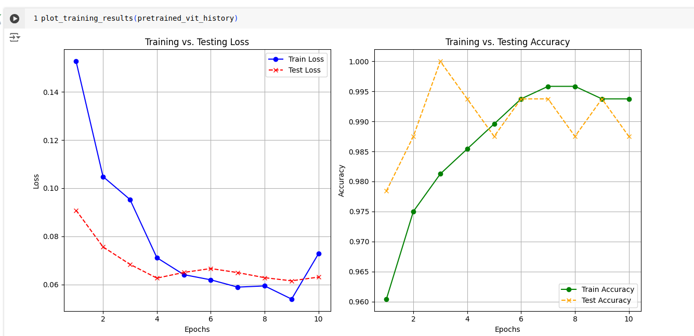

# Vision Transformer Replication

I replicated the Vision Transformer (ViT) using Python and PyTorch, absolutely from scratch. This project involves building the Vision Transformer architecture without relying on pre-built modules, providing a deeper understanding of how this state-of-the-art model works.

## Vision Transformer Architecture

The Vision Transformer (ViT) divides an image into patches, applies a transformer to these patches, and then predicts labels. This implementation includes:
- **Patch Embedding**: Splits images into patches and embeds them.
- **Transformer Encoder**: Applies multi-head self-attention and feed-forward layers.
- **Classification Head**: Final dense layers for classification tasks.

**Original paper:** https://arxiv.org/abs/2010.11929

